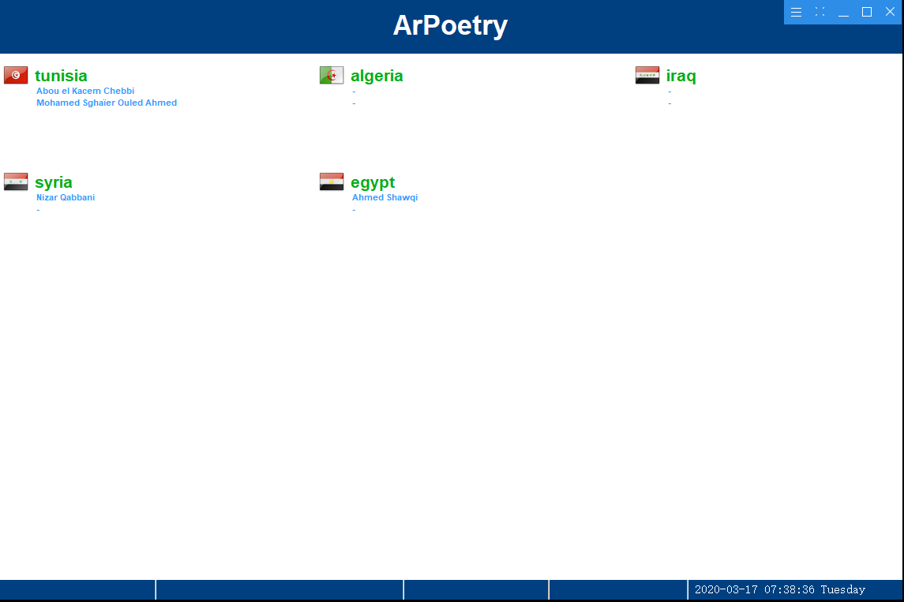
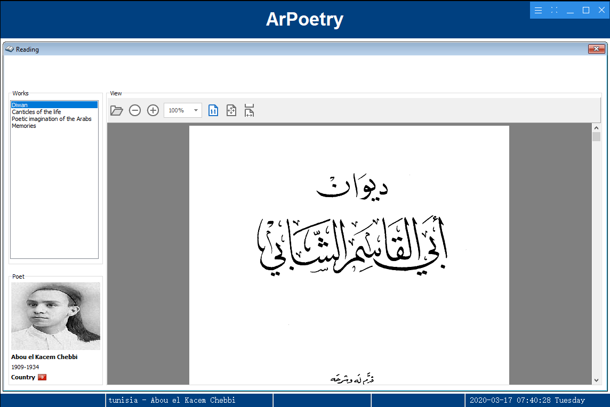

# ArPoetry (Desktop)

# Menu View

# Collection View

`ArPoetry` is a Software for Management Poetry books.

**Authors:**  *WalWalWalides*

The Software offers a new Way for better Management Poetry books.
`ArPoetry` is an excellent app for Arbic Poetry Lovers that stores all your books in one place.

- Name  
  Chedly.apk

- Size
    40 MB

- Category
    Entertainment 
    
- Compatibility
    Requires Up windows10 . 

- Languages
    English

- Copyright
    © walwalwalwalides

- Price
    Free 

Principal Software Benefits:

      - Add new Books.
         
      - Create a thumbnail.
      
      - Order poetries by country.

    

## Contains

| Module | Name | 
| --- | --- |
|ArPoetry_Setup.exe|Executable Setup For ArPoetry|

------

## To Install the Software:

### Install Software ( Desktop ) 

Link : https://github.com/walwalwalides/ArPoetry/releases/download/V1.0.0/ArPoetry__Setup.exe

### Demo
How to read sounds 
[Youtub Video] : https://www.youtube.com/watch?v=8ykRAamahQc

# If You Want To Donate!

